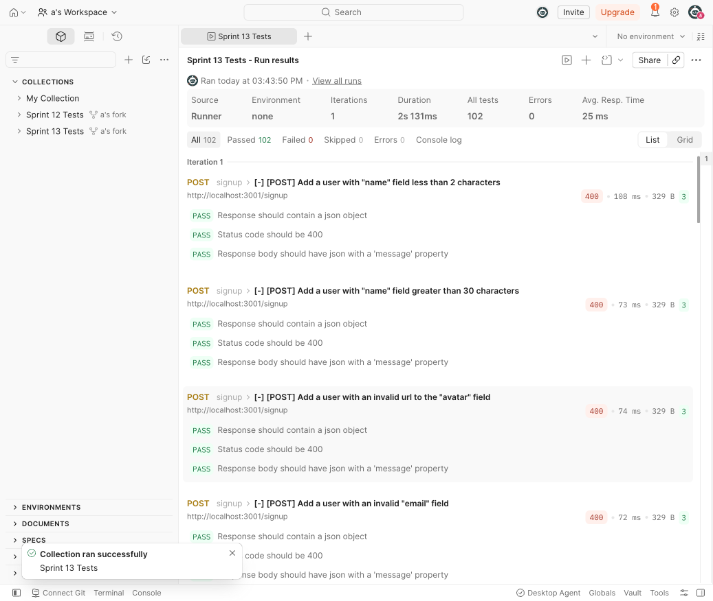

# WTWR (What to Wear?): Back End
The back-end project is focused on creating a server for the WTWR application. You’ll gain a deeper understanding of how to work with databases, set up security and testing, and deploy web applications on a remote machine. The eventual goal is to create a server with an API and user authorization.

## Live Project
- Domain: [closetforecast-oy.crabdance.com](http://closetforecast-oy.crabdance.com)
- API: [api.closetforecast-oy.crabdance.com](http://api.closetforecast-oy.crabdance.com)
- Front-end repo: [se_project_react](https://github.com/oelctric/se_project_react)

## Functionality
This server provides a REST API for the WTWR app, secured with JWT authentication:
- `POST /signup` — create a new user (`name`, `avatar`, `email`, `password`)
- `POST /signin` — log in with `email`/`password`, returns a JWT
- `GET /users/me` — return the logged-in user's data (protected)
- `PATCH /users/me` — update the logged-in user's `name`/`avatar` (protected)
- `GET /items` — return all clothing items (public)
- `POST /items` — create a new clothing item (protected)
- `DELETE /items/:itemId` — delete a clothing item you own (protected; `403` if it's someone else's)
- `PUT /items/:itemId/likes` — like a clothing item (protected)
- `DELETE /items/:itemId/likes` — unlike a clothing item (protected)

All routes except `POST /signup`, `POST /signin`, and `GET /items` require a `Bearer` JWT in the `Authorization` header. Requests to unknown routes return a `404` with `{ "message": "Requested resource not found" }`, and invalid data or malformed request bodies return a `400` with a descriptive `message`.

## Technologies and techniques used
- Node.js and Express for the HTTP server and routing
- MongoDB with Mongoose for data modeling and persistence (schema validation, refs, `orFail`)
- JWT-based authentication (`jsonwebtoken`) with a custom authorization middleware
- Password hashing with `bcryptjs`; password hashes are never returned by the API
- `cors` for cross-origin requests from the front end
- ESLint (Airbnb base config) and Prettier for linting/formatting
- `validator` for URL/email validation on user/item fields
- nodemon for hot reload during development

## Running the Project
`npm run start` — to launch the server 

`npm run dev` — to launch the server with the hot reload feature

### Testing
All 88 requests in the Sprint 12 Postman test suite pass against this server:

All 102 requests in the Sprint 13 Postman test suite (authentication and authorization) pass against this server:

## Project Pitch Video
[Video coming soon — recording in progress]

<!-- Replace with the Sprint 15 pitch video covering the full-stack project (frontend + backend) before submitting for review. -->
