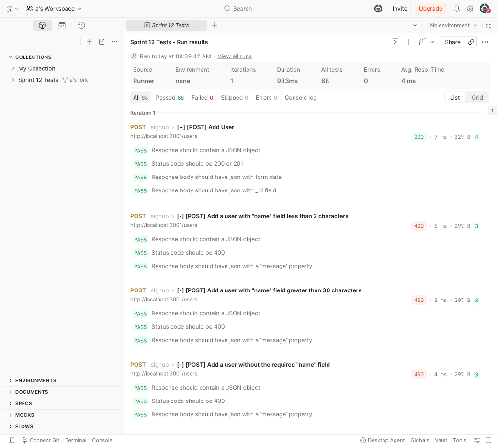

# WTWR (What to Wear?): Back End
The back-end project is focused on creating a server for the WTWR application. You’ll gain a deeper understanding of how to work with databases, set up security and testing, and deploy web applications on a remote machine. The eventual goal is to create a server with an API and user authorization.

## Functionality
This server provides a REST API for the WTWR app:
- `GET /users` — return all users
- `GET /users/:userId` — return a user by `_id`
- `POST /users` — create a new user
- `GET /items` — return all clothing items
- `POST /items` — create a new clothing item
- `DELETE /items/:itemId` — delete a clothing item by `_id`
- `PUT /items/:itemId/likes` — like a clothing item
- `DELETE /items/:itemId/likes` — unlike a clothing item

Requests to unknown routes return a `404` with `{ "message": "Requested resource not found" }`, and invalid data or malformed request bodies return a `400` with a descriptive `message`.

## Technologies and techniques used
- Node.js and Express for the HTTP server and routing
- MongoDB with Mongoose for data modeling and persistence (schema validation, refs, `orFail`)
- ESLint (Airbnb base config) and Prettier for linting/formatting
- `validator` for URL validation on user/item fields
- nodemon for hot reload during development

## Running the Project
`npm run start` — to launch the server 

`npm run dev` — to launch the server with the hot reload feature

### Testing
All 88 requests in the Sprint 12 Postman test suite pass against this server:

